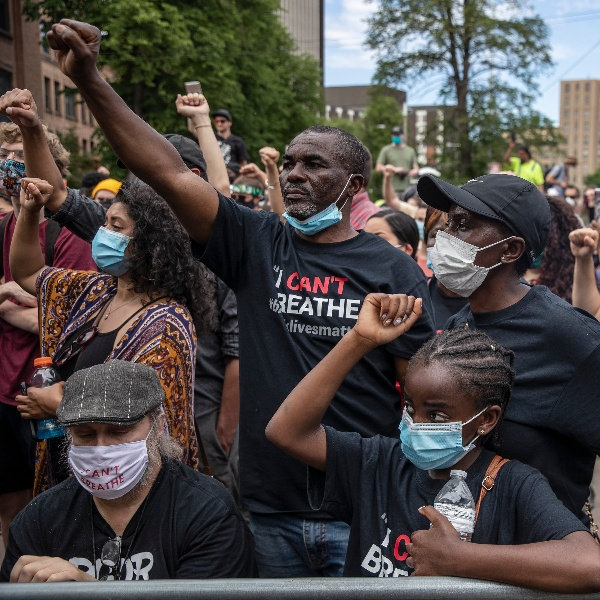
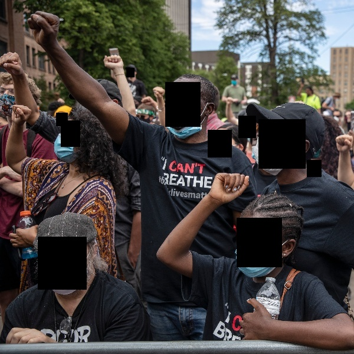

# RedactMe
An open source image anonymizer.

  

## Table of Contents

- [Quickstart](#quickstart)
    - [Environment](#environment)
- [Gallery](#gallery)

# Quickstart

## Environment
```
conda env create -f environment.yml
conda activate make-anon
```

# Gallery