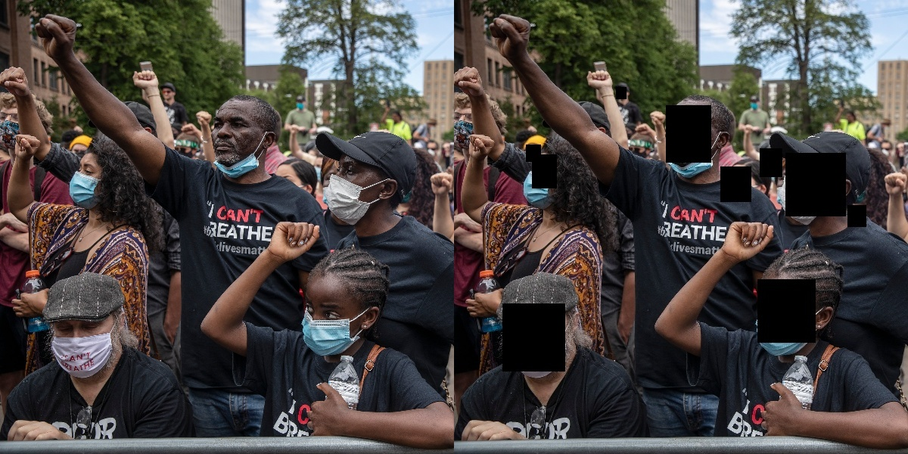

# RedactMe
An open source image anonymizer.



## Table of Contents

- [Quickstart](#quickstart)
    - [Environment](#environment)
    - [Local Usage](#local-usage)

# Quickstart

## Environment
```
conda env create -f environment.yml
conda activate make-anon
```

## Local Usage
```
python main.py <PATH_TO_IMAGE>
```
This will save your image with the redactions to `redacted_<PATH_TO_IMAGE>`, e.g. `test.jpg` to `redacted_test.jpg`.